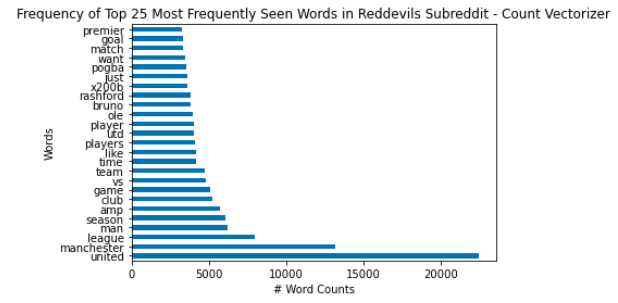

# Web APIs & NLP to categorize the subreddit posts for Rival Manchester teams

### Executive Summary

Manchester City and Manchester United lead the English Premier League, and arguably all of Europe in their fan base. This is evident in their subreddit subscriber counts of 86.4K and 302K respectively as of July 30, 2021. 

Using the Pushshift API, I webscraped 50,000 posts from each subreddit, did data cleaning to organize the post content, and created two classification models intended to take post content as a predictor variable and predict the subreddit that the post came from.

Given the fact that the two subreddit accounts are team names, and most post discussions revolve around players on the team, it was very easy to get a very high accuracy score on predicting the subreddit the post came from.

However, because of this, this really did not provide us with new information.

I would like to extend this project in the future to gather more data for a longer period of time, categorize by seasons to explore activity during particular phases of a season or off-season (if standings during and at the end of the season affect anything).

### Problem Statement

What are the characteristics of the post content that lead to successful classification of posts to their respective subreddits? What makes the MCFC subreddit subscriber count lower than the reddevils subscriber count?

### Data Collection

Using the [Pushshift API](https://github.com/pushshift/api), approximately 50,000 posts each were collected from the below two subreddits.

* https://www.reddit.com/r/MCFC/
* https://www.reddit.com/r/reddevils

From these two subreddits, I collected the following information:
- title
- author
- created_utc
- subreddit
- selftext

### Data Cleaning

- Converted created_utc into DateTime type for easier interpretation of date,
- Reddit content
    - Combined title and selftext columns into one string column,
    - Replaced null values with empty strings (''),
    - Replaced urls with empty strings (''),
- Binarized subreddit (MCFC or reddevils) for classification purposes

### Exploratory Data Analysis

Categorization of Posts by Year

Because Manchester United has approximately 4 times the number of subscribers as Manchester City, our post collection only captured posts from the period of October 2019 - July 2021.

Our posts collection from the Manchester City captured posts from February 2016 - July 2021. For the full years of 2017 - 2020, we seem to find a relatively similar post count compared with 2016 and 2021.

Natural Language Processing
1. <b>RegExTokenizer</b> - "Tokenized" (Split) title + selftext string into their respective words, with special RegEx code to remove special characters,
2. <b>WordNetLemmatizer</b> - "Lemmatized" (broke down and categorized) tokenized words into similar words
3. <b>Count/TFIDF (Term Frequency Inverse Document Frequency) Vectorizer</b> - Took the lemmatized word list and created a matrix to convert the presence of a word into a numeric value, ultimately to visualize top word counts of each subreddit per vectorization method.

<b>Count Vectorizer Word Counts:</b>

Common words seen: Premier, goal(s), player(s), like, team, game, season, man (for Manchester), league, Manchester

<b>TFIDF Vectorizer Word Counts:</b>

Common words seen: team, goal, game, league, man, united, season, vs, Manchester

Unique words seen in subposts were predominantly player/coach names.

I also attempted using the Sentiment Intensity Analyzer to assess Sentiment scores. Because we were dealing with well moderated subreddits, as well as the fact that we were dealing with titles predominantly, and not user comments, I did not find any sentiment scores.

### Binary Classification Models

#### Model 1: Random Forest
1. Count Vectorizer
2. TFIDF Vectorizer

|Metric|Count Vectorizer|TFIDF Vectorizer|
|---|---|---|
|**Accuracy**|0.8857|0.8867|
|**Precision**|0.8729|0.8625|
|**Sensitivity**|0.8985|.9109|
|**Precision**|0.8760|0.8688|

#### Model 2
1. Count Vectorizer
2. TFIDF Vectorizer

|Metric|Count Vectorizer|TFIDF Vectorizer|
|---|---|---|
|**Accuracy**|0.8687|0.8687|
|**Precision**|0.7927|0.7927|
|**Sensitivity**|0.9449|.9449|
|**Precision**|0.82|0.82|

Two models were prepared.
1. Random Forest
    * Count Vectorizer to process language
    * TFIDF Vectorizer to process language
2. Naive Bayes
    * Count Vectorizer to process language
    * TFIDF Vectorizer to process language

### Analysis

The Random Forest model had the best results for the training data by far.
It's training data for the Count Vectorizer method and TFIDF Vectorizer method produced results of 0.9922 and 0.9921 respectively. Given the results above, there was obviously some overfitting.

The Random Forest calculations took 2 hours to complete on my computer, so definitely hard to reproduce results.

The Naive Bayes model was a lot quicker. I used a grid search with parameters max_df from 0.9 to 0.95, min_df from 2 to 3 documents, and max_features from 2000 to 3000.

Accuracy score for training data was 0.8753 for both.

You'll notice here that the scores were very high. This is because of the nature of our subreddit. Our subreddits chosen here are for two sports teams. Naturally, we would have the majority (if not all) of the posts contain the name of the team (in some form), or players on that team. 

I tried creating a second instance of the Naive Bayes model where I removed instances of 'city' and 'united' from the strings, but still obtained pretty high results. (notebook 06)

### Conclusion

"Proper nouns" seem to dictate post classifications i.e. the team name, or player names. I was expecting heated tactical discussions on team play style, but that doesn't seem to play a role in the classifications that my model made.

Also, because the model trains itself on those key words, it seems to provide no suggestive features on how to fill the gap in subscriber count (i.e. no indication on how to increase Manchester City's subreddit subscriber count).

### Repository Contents

* 01_Data_Collection-Submissions.ipynb
* 02_Data_Cleaning_and_EDA.ipynb
* 03_Models_random_forest_cvec.ipynb
* 04_Models_random_forest_tvec.ipynb
* 05_Models_Naive_Bayes_cvec_tvec.ipynb
* 06_Models_Naive_Bayes_cvec_tvec-remove_names.ipynb
* README - ATakahashi.md
* data
    * mcfc.csv
    * reddevils.csv
    * submissions_clean.csv
    * submissions_model.csv
    
### Disclaimer

As recently as during [The 2020 UEFA European Football Championship](https://www.uefa.com/uefaeuro-2020/), or commonly referred to as "The Euros," the world has seen how passionate English fans can be towards football, the sport that the English claim originated in their homesoil. Playing 6 of their 7 games in London, "Football's coming home!" was a phrase commonly heard in June and July, given the England football team's progression to the finals in the tournament.

Sports has the power to unite people, as witnessed by not only the Euros, but also other major sporting events, such as the Olympics, the NFL's Superbowl, and the MLB's World Series. However, at times passion leads to violence both in the physical and virtual forms. Before the final match of Euro 2020, fans driven by dangerously excessive passion broke into Wembley Stadium, many without a valid ticket to the match [(Source)](https://www.goal.com/en/news/dangerous-scenes-at-wembley-as-fans-try-to-get-into-stadium/1677zuqjkgnkb14uqz9n1pj17c). To make matters worse, when England ultimately lost to winners Italy in Penalty Kicks, a few members of the England team were subject to racial abuse on social media [(Source)](https://www.goal.com/en/news/england-fa-condemns-disgusting-racist-abuse-directed-towards/hf0gwya48qs61rh35c5ta52s7).

<u><b>I would like to clarify that while I share the passion for the sport along with many fans around the world, any views expressed in the posts collected in the subreddits that are critical in nature towards players for any reason do not reflect my own.</b></u>
